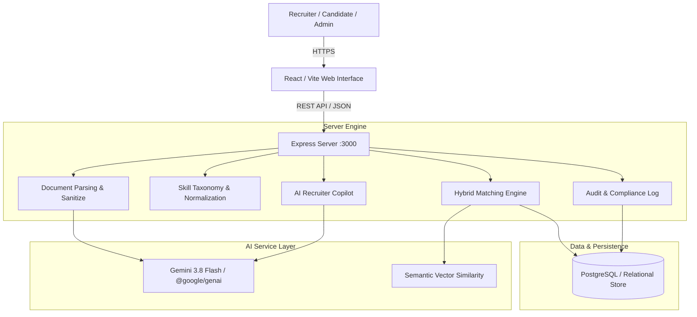

# TalentLens AI — System Architecture

This document describes the architectural layout, component interaction, and data flows of the TalentLens AI platform.

## 1. High-Level Architecture

## 2. Core Subsystems

### 2.1 Frontend Architecture
- **Framework**: React 19 with Vite, Tailwind CSS v4, Lucide React icons.
- **State Management**: Reactive in-memory state with live API synchronization.
- **Views**:
  - `Public Landing`: Interactive walkthrough of Evidence-First philosophy and live feature selector.
  - `Recruiter Portal`: Dashboard metrics, Job Creation with Quality Analyzer, Candidate Ranking Board, Explainable Evidence Card, What-If Simulator, Blind Screening, and AI Recruiter Copilot.
  - `Candidate Portal`: Profile, Resume Upload & Parser, Reverse Job Matches, Interactive Skill Graph, Resume Version Comparison, and GitHub Evidence Inspector.
  - `Admin / Fairness`: System metrics, Audit Logs, and Bias minimization metrics.

### 2.2 Backend Architecture
- **Runtime**: Node.js with TypeScript and Express.js (`server.ts`).
- **Middleware**:
  - Request logging with latency and request ID tracking.
  - Input validation and prompt injection neutralization.
  - Error-shielding middleware converting exceptions to standard JSON error payloads.
- **Service Layer**:
  - `ResumeParserService`: Multi-format text extraction (PDF, DOCX, TXT) and structured entity extraction (Candidate, Experiences, Projects, Skills, Education).
  - `SkillOntologyService`: Canonical mapping of 60+ skills, synonym aliasing, hierarchy trees, and transferability matrix.
  - `MatchingService`: Mathematical composite scoring combining required skill coverage (35%), preferred skill coverage (15%), semantic similarity (20%), experience depth (15%), project evidence (10%), and domain alignment (5%).
  - `ExplainabilityService`: Granular itemization of match status (`MATCH`, `PARTIAL`, `TRANSFERABLE`, `MISSING`) with direct evidence text citations.
  - `CopilotService`: Grounded LLM reasoning agent answering comparative candidate questions without hallucinations.

### 2.3 Data Layer
- **PostgreSQL / Supabase Schema**: Designed with normalized tables for users, candidates, recruiters, jobs, resumes, candidate_skills, job_skills, skill_relationships, matches, match_evidence, screening_questions, and audit_logs.
- **In-Memory Store with Demo Seed**: High-performance local store pre-populated with 10 diverse candidates, 5 complex job requisitions, and full skill graphs for instant verification.

### 2.4 Security & Data Protection
- **Role-Based Access Control**: Strict segregation between CANDIDATE, RECRUITER, and ADMIN endpoints.
- **Blind Screening**: Masks candidate names, avatars, contact emails, and personal identifiers to `Candidate #XXXX` during technical review.
- **Untrusted Document Defense**: Resume and job text are sanitized and parsed into validated JSON schemas before any model processing to prevent prompt injection attacks.
